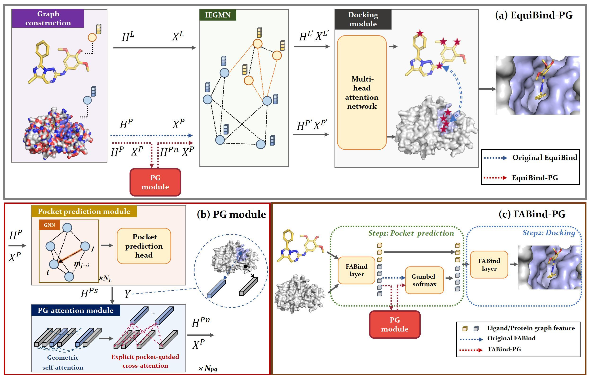

# PGBind
PGBind: Pocket-guided explicit attention learning for protein-ligand docking


# 📚 Overview
As more and more protein structures are discovered, blind protein-ligand docking will play an important role in drug discovery because it can predict protein-ligand complex conformation without pocket information on the target proteins. Recently, deep learning-based methods have made significant advancements in blind protein-ligand docking, but their protein features are suboptimal because they do not fully consider the difference between potential pocket regions and non-pocket regions in protein feature extraction. In this work, we propose a pocket-guided strategy for guiding the ligand to dock to potential docking regions on a protein. To this end, we design a plug-and-play module to enhance the protein features, which can be directly incorporated into existing deep learning-based blind docking methods. The proposed module first estimates potential pocket regions on the target protein and then leverages a pocket-guided attention mechanism to enhance the protein features. Experiments are conducted on integrating our method with EquiBind and FABind, and the results show that their blind-docking performances are both significantly improved and new start-of-the-art performance is achieved by integration with FABind. 




# 🔬 Environment
````
python=3.7
pytorch 1.10
torchvision
cudatoolkit=10.2
torch-geometric==2.4.0
torchdrug==0.1.2 
torchmetrics==0.10.2
torchaudio
dgl-cuda10.2
rdkit
openbabel
biopython
rdkit
biopandas
pot
dgllife
joblib
pyaml
icecream
matplotlib
tensorboard
geotransformer
Bio
lmdb
fair-esm 

````
# ⚙ Datasets and pre-trained models
If you want to train one of our models with the data then: 
1. Equibind-PG: follow EquiBind, download dataset from [zenodo](https://zenodo.org/record/6408497), and unzip the directory and place it into `data` such that you have the path `data/PDBBind`
2. FABind-PG: follow FABind, download dataset from [zenodo](https://zenodo.org/records/11352521), and unzip the `zip` file and place it into `data_path` such that `data_path=pdbbind2020`

We also provided pre-trained models, which you can download from [`https://drive.google.com/file/d/1JjXfiIuDcrVQAx2YnkdBM2YJUfPof8pM/view?usp=drive_link`](https://drive.google.com/file/d/1JjXfiIuDcrVQAx2YnkdBM2YJUfPof8pM/view?usp=drive_link). 
# 🚀 Equibind-PG
```shell
cd Equibind_PG
```
## Training a model yourself and using those weights
To train the model yourself, run:
```shell
python train.py --config=configs_clean/RDKitCoords_flexible_self_docking.yml
```

The model weights are saved in the `runs` directory.\
You can also start a tensorboard server ``tensorboard --logdir=runs`` and watch the model train. \
To evaluate the model on the test set, change the ``run_dirs:`` entry of the config file `inference_file_for_reproduce.yml` to point to the directory produced in `runs`.
Then you can run``python inference.py --config=configs_clean/inference_file_for_reproduce.yml`` as above!

## Predict Binding Structures
In the config file `configs_clean/inference.yml` set the path to your input data folder `inference_path: path_to/my_data_folder`.  
Then run:
```shell
python inference.py --config=configs_clean/inference.yml
```
# 🚀 FABind-PG
```shell
cd FABind_PG
```
## Re-training
```shell
data_path=pdbbind_2020
python fabind/main_fabind.py \
    --batch_size 3 \
    -d 0 \
    -m 5 \
    --data-path $data_path \
    --label baseline \
    --addNoise 5 \
    --resultFolder ./results \
    --use-compound-com-cls \
    --total-epochs 500 \
    --exp-name train_tmp \
    --coord-loss-weight 1.0 \
    --pair-distance-loss-weight 1.0 \
    --pair-distance-distill-loss-weight 1.0 \
    --pocket-cls-loss-weight 1.0 \
    --pocket-distance-loss-weight 0.05 \
    --lr 5e-05 --lr-scheduler poly_decay \
    --distmap-pred mlp \
    --hidden-size 512 --pocket-pred-hidden-size 128 \
    --n-iter 8 --mean-layers 4 \
    --refine refine_coord \
    --coordinate-scale 5 \
    --geometry-reg-step-size 0.001 \
    --rm-layernorm --add-attn-pair-bias --explicit-pair-embed --add-cross-attn-layer \
    --noise-for-predicted-pocket 0 \
    --clip-grad \
    --random-n-iter \
    --pocket-idx-no-noise \
    --pocket-cls-loss-func bce \
    --use-esm2-feat
```
## Evaluation
```shell
python fabind/test_fabind.py \
    --batch_size 4 \
    --data-path $data_path \
    --resultFolder ./results \
    --exp-name test_exp \
    --ckpt $ckpt_path \
    --local-eval
```

# 🤖 Train pocket_label
```shell
cd Equibind_clean
python train_pocket.py
```
